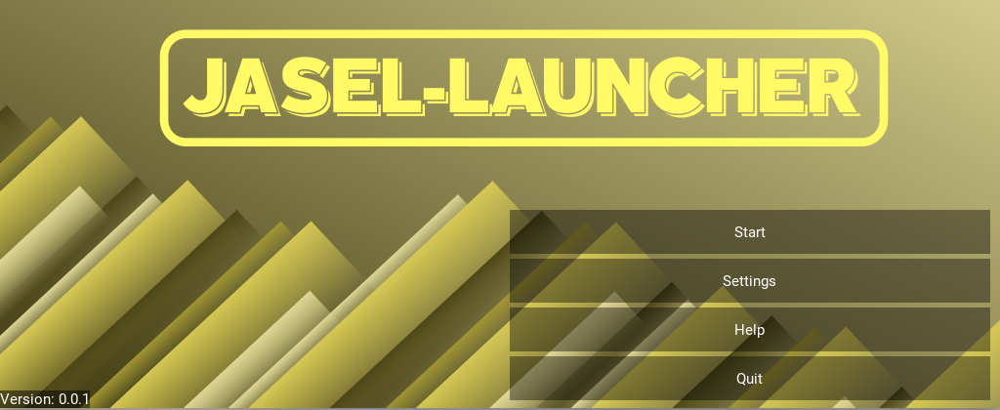

Game Launcher
----------------

This game launcher is designed for the UPBGE, but will probably be usable with any kind of executable.
The original idea was to have something that can be linked to the steamworks API, since they don't
allow communication between steam and a GPL licensed application.
This launcher will read settings from a specified .json file and handle messages from and to Steam, like
achievements, versioning, network info, game settings etc.
